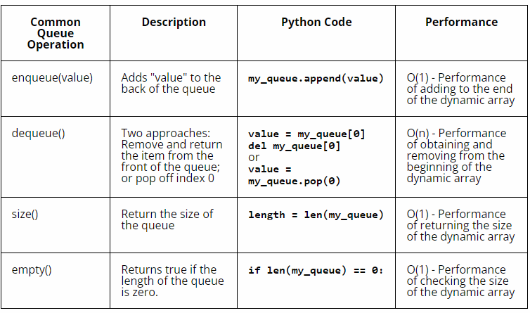

# Queue

A queue is a linear data structure that follows the principle of "first-in, first-out" (FIFO).It represents a collection of elements where new elements are inserted at one end(back), and existing elements are removed from the other end (front).

The purpose of using queue is to provide an efficient way to manage elements in a sequential order, following the FIFO principle. It allows for the insertion of elements at one end and removal from the other, making it suitable for scenarios where order matters, such as task scheduling, event handling, and managing resources in a fair manner.

## EXAMPLE OF QUEUE

A queue can be visualized as a real-life queue, such as people waiting in line.


The person who arrives first joins the queue first and gets served first, while the person who arrives later joins at the end and gets served after everyone ahead of them.

When the person at the front is removed from the queue we call this a dequeue operation. When a new person joins the queue at the back, we call this an enqueue operation. No one can cheat and enter the line in the middle of the queue.

## QUEUES IN PYTHON

In Python, a queue can be represented using a list.

Here's an example of how to use a queue in Python:

```python
# Create an empty queue using a list
queue = []

# Enqueue elements
queue.append(10)
queue.append(20)
queue.append(30)

# Dequeue elements
item = queue.pop(0)
print(item)  
# # Expected Result: 10

# Peek at the front element
front_item = queue[0]
print(front_item)  
# Expected Result: 20

# Check if the queue is empty
is_empty = len(queue) == 0
print(is_empty)  
# Expected Result: False

# Get the size of the queue
size = len(queue)
print(size)  
# Expected Result: 2

```

The append() method is used to enqueue elements, and the pop(0) method is used to dequeue elements. The rest of the operations, such as peeking, checking emptiness, and getting the size, are the same as the previous example. 

The performance of the queue using a Python list is based on the performance of the dynamic array.




## Example: Random Number Guessing Game


```python
import random

print("Welcome")
play_again = "YES"  # This will allow us into the loop the first time
while play_again == "YES":
    rand_num = random.randint(1,100)
    num_guesses = 0
    guess = -1 # This will allow us into the loop the first time
    while guess != rand_num:
        guess = int(input("Enter a guess: "))
        num_guesses += 1
        if guess < rand_num:
            print("Higher!")
        elif guess > rand_num:
            print("Lower!")
    print("Congrats!")
    print("It took {} guesses.".format(num_guesses))
    play_again = input("Play again? ")
print("Goodbye")
```

## Problem to Solve : Geometric Series Sum

Write a program that will allow the user to estimate the sum of geometric series.  A geometric series one where each element in the series is calculated by multiplying the previous value by a constant.  For example, here is a geometric series:
$$
1, \frac{1}{2}, \frac{1}{4}, \frac{1}{8}, \frac{1}{16}, \frac{1}{32}
$$
The series begins at 1 (called the initial term) and each number is determined by multiplying the previous number by 0.5 (called the series).  You should use a loop to add all of the numbers in the series.  You will have to ask the user for three things:

- What is the initial term in the series
- What is the ratio to use to calculate each number in the series
- How many terms in the series to calculate and add together (not including the initial term)

After displaying the answer, you should allow the user to calculate another sum instead of exiting the program.  You can ignore cases where the user types in invalid values (e.g. ratio of 0, number of terms in the series <= 0, etc).

The example execution show how a ratio of 0.5 converges the sum towards 2 and how a ratio of 2 does not converge but instead goes towards infinity.

```
Initial Term: 1
Ratio: 0.5
Terms to add: 5
Sum = 1.96875000000000000000

Again (Y/N)? Y
Initial Term: 1
Ratio: 0.5
Terms to add: 20
Sum = 1.99999904632568359375

Again (Y/N)? Y
Initial Term: 1
Ratio: 0.5
Terms to add: 50
Sum = 1.99999999999999911182

Again (Y/N)? Y
Initial Term: 1
Ratio: 2
Terms to add: 5
Sum = 63.00000000000000000000

Again (Y/N)? Y
Initial Term: 1
Ratio: 2
Terms to add: 20
Sum = 2097151.00000000000000000000

Again (Y/N)? Y
Initial Term: 1
Ratio: 2
Terms to add: 50
Sum = 2251799813685247.00000000000000000000

Again (Y/N)? N
```

You can check your code with the solution here: [Solution](geometric_series_sum.py)


[Back to Welcome Page](0-welcome.md)


