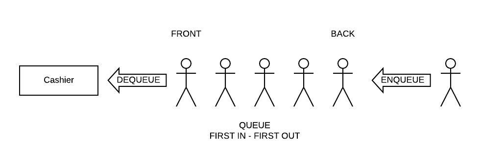
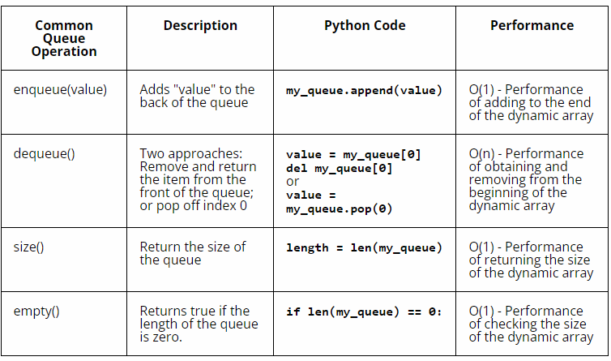

# Set

A queue is a linear data structure that follows the principle of "first-in, first-out" (FIFO).It represents a collection of elements where new elements are inserted at one end(back), and existing elements are removed from the other end (front).

The purpose of using queue is to provide an efficient way to manage elements in a sequential order, following the FIFO principle. It allows for the insertion of elements at one end and removal from the other, making it suitable for scenarios where order matters, such as task scheduling, event handling, and managing resources in a fair manner.

## EXAMPLE OF LINKED LIST

A queue can be visualized as a real-life queue, such as people waiting in line.



The person who arrives first joins the queue first and gets served first, while the person who arrives later joins at the end and gets served after everyone ahead of them.

When the person at the front is removed from the queue we call this a dequeue operation. When a new person joins the queue at the back, we call this an enqueue operation. No one can cheat and enter the line in the middle of the queue.

## LINKED LIST IN PYTHON

In Python, a queue can be represented using a list.

Here's an example of how to use a queue in Python:

```python
# Create an empty queue using a list
queue = []

# Enqueue elements
queue.append(10)
queue.append(20)
queue.append(30)

# Dequeue elements
item = queue.pop(0)
print(item)  
# # Expected Result: 10

# Peek at the front element
front_item = queue[0]
print(front_item)  
# Expected Result: 20

# Check if the queue is empty
is_empty = len(queue) == 0
print(is_empty)  
# Expected Result: False

# Get the size of the queue
size = len(queue)
print(size)  
# Expected Result: 2

```

The append() method is used to enqueue elements, and the pop(0) method is used to dequeue elements. The rest of the operations, such as peeking, checking emptiness, and getting the size, are the same as the previous example. 

The performance of the queue using a Python list is based on the performance of the dynamic array.




## Example Code: Print Job Scheduler

In this scenario, you are developing a print job scheduler for a printer. Multiple users send print jobs to the printer, and the scheduler needs to ensure that the jobs are processed in the order they were received.

```python
class PrintJobScheduler:
    def __init__(self):
        self.queue = []

    def enqueue_job(self, job):
        self.queue.append(job)
        print(f"Job '{job}' added to the print queue.")

    def process_jobs(self):
        while self.queue:
            job = self.queue.pop(0)
            print(f"Printing job: '{job}'")

scheduler = PrintJobScheduler()

# Enqueue print jobs
scheduler.enqueue_job("Document1")
scheduler.enqueue_job("Document2")
scheduler.enqueue_job("Document3")

# Process print jobs
scheduler.process_jobs()

```
Using a queue in this scenario ensures that the print jobs are processed in the order they were received, following the FIFO principle. It provides a fair scheduling mechanism where the first job to arrive is the first to be printed.

The queue allows for efficient insertion of new print jobs at the back and removal of jobs from the front, ensuring that the jobs are processed in the correct order. It also handles cases when multiple print jobs are submitted concurrently, managing them in a sequential manner.

## Problem to Solve : Call Center Customer Support

Write a program to help the call center receives incoming customer calls that need to be handled by customer support representatives. The calls should be serviced in the order they are received.


You can check your code with the solution here: [Solution](callcenter.py)


[Back to Welcome Page](0-Welcome.md)


