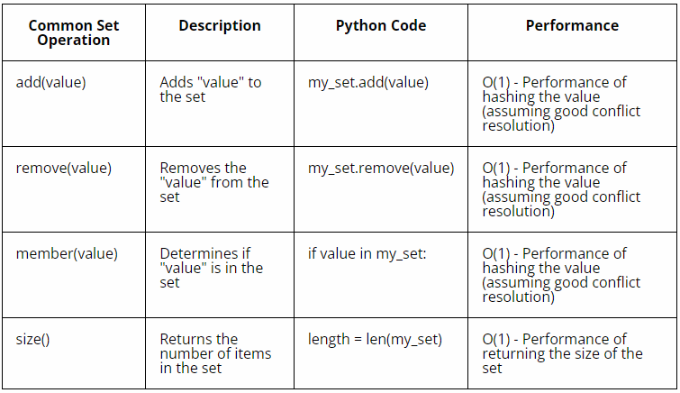

# Set

A set is a data structure that represents a collection of distinct elements with no specific order. The purpose of using sets are to ensure uniqueness, perform efficient membership testing, and leverage set operations for combining, comparing, or analyzing collections of elements. Sets provide a convenient and efficient way to work with distinct values and solve problems related to uniqueness and set theory. It is commonly used to perform operations such as membership testing, intersection, union, and difference.

## EXAMPLE OF SET

Let's use hashing as an example, the set is able to add, remove, and test for membership in O(1) time.


In the example above, we have several one-digit numbers added to the list according to the index rule. One important observation is that checking if a number exists in the list becomes a constant time operation (O(1)) because we can directly calculate the index.

There is only one position for each value in the set, duplicates are not allowed because there would be no place to put them. In summary, using this approach, we can create a set with O(1) performance for operations like adding, removing, and checking membership, making it efficient for working with a small range of unique elements.

## SET IN PYTHON

In Python, a set can be represented using a curly braces (e.g. my_set = {1, 2, 3}) To create an empty set (unlike an empty list), we use the code: empty_set = set().

Here's an example of how to use a set in Python:

```python
# Creating a set
fruits = {'apple', 'banana', 'orange', 'apple', 'pear'}

print(fruits)
# Expected Result: {'apple', 'pear', 'banana', 'orange'}

# Adding elements to a set
fruits.add('grape')
print(fruits)
# Expected Result: {'apple', 'pear', 'banana', 'grape', 'orange'}

# Removing an element from a set
fruits.remove('banana')
print(fruits)
# Expected Result: {'apple', 'pear', 'grape', 'orange'}

# Checking membership in a set
print('apple' in fruits)
# Expected Result: True

# Performing set operations
vegetables = {'carrot', 'spinach', 'tomato', 'apple'}

# Union of two sets
all_items = fruits.union(vegetables)
print(all_items)
# Expected Result: {'apple', 'carrot', 'spinach', 'grape', 'tomato', 'orange', 'pear'}

# Intersection of two sets
common_items = fruits.intersection(vegetables)
print(common_items)
# Expected Result: {'apple'}

# Difference between two sets
unique_fruits = fruits.difference(vegetables)
print(unique_fruits)
# Expected Result: {'pear', 'grape', 'orange'}

# Size of a set
print(len(fruits))
# Expected Result: 4


```

In the above example, a set called fruits is created, containing various fruit names. Since sets do not allow duplicates, any duplicate elements are automatically removed. Elements can be added to the set using the add() method and removed using the remove() method.

Membership testing is demonstrated by checking if the element 'apple' is present in the set. Set operations like union, intersection, and difference are performed between the fruits set and a vegetables set. The size of the set is obtained using the len() function.

The performance of the set is based on the performance of the hashing algorithm.




## Example Code: Finding Common Colors

Imagine you have collections of colored objects, and you want to compare collections and find common colors. 

You can use a set to accomplish this efficiently. Here's a simple code example:

```python
# Create sets for unique colors in two collections
colors_set1 = {'red', 'blue', 'green', 'yellow'}
colors_set2 = {'blue', 'yellow', 'purple', 'pink'}

# Find common colors using set intersection
common_colors = colors_set1 & colors_set2

# Display the common colors
print("Common Colors:")
for color in common_colors:
    print(color)

# Calculate the number of common colors
num_common_colors = len(common_colors)
print(num_common_colors)

```
In this scenario, we have two sets, colors_set1 and colors_set2, representing unique colors in two different collections. We want to compare these sets to find the common colors.

We use the intersection() method to find the common colors between the two sets. The resulting set, common_colors, contains only the colors that exist in both sets.

Finally, we display the common colors by iterating over the common_colors set and printing each color. We also calculate the number of common colors by obtaining the length of the set using len().

This program demonstrates how sets and set operations can be used to efficiently compare collections and find common elements, such as common colors between two sets.

## Problem to Solve : Merging Email Lists

Write a program to merge two email marketing lists from different sources and create a consolidated list without any duplicate email addresses.


You can check your code with the solution here: [Solution](set.py)


[Back to Welcome Page](0-Welcome.md)


