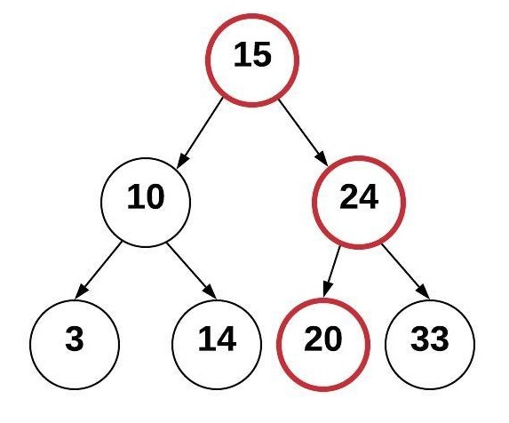

# Tree

A tree is a data structure that consists of nodes connected by pointers. It is a widely used data structure that resembles a tree in nature, with a single node known as the root and other nodes branching out from it.

## EXAMPLE OF TREE

Here is an example of binary tree, it is a tree that links to no more than two other nodes.


Node: Each element in the tree is called a node. Nodes can have zero or more child nodes.

Root: The topmost node of the tree, which does not have any parent nodes.

Parent and Child: A node that is connected to another node directly below it is considered the parent, while the connected node is its child.

Leaf: Nodes that do not have any child nodes are referred to as leaf nodes or terminal nodes.

Subtree: A subtree is a portion of the tree that consists of a node and all its descendants.

Here is an example of binary search tree:



When searching for a specific value in a binary search tree, comparisons are made at each node to determine whether to continue searching in the left or right subtree. By following the ordering property, the search operation can be performed by traversing only a fraction of the tree, resulting in a time complexity of O(log n) on average for search operations.

Using the tree above, we can determine where to put additional items. We always start at the root node and compare the new value with it. We keep comparing until we have found an empty place for the new node. For example, to insert the value 20, do the following:

Start at the root node 15 and compare with the new value 20

Since 20 is greater than 15, goto the right and visit node 24

Since 20 is less than 24, goto the left and see there is no additional node

Insert 20 in the empty spot to the left of 24.


## TREE IN PYTHON

In Python, a set can be represented using a curly braces (e.g. my_set = {1, 2, 3}) To create an empty set (unlike an empty list), we use the code: empty_set = set().

Here's an example of how to use a set in Python:

```python
# Creating a set
fruits = {'apple', 'banana', 'orange', 'apple', 'pear'}

print(fruits)
# Expected Result: {'apple', 'pear', 'banana', 'orange'}

# Adding elements to a set
fruits.add('grape')
print(fruits)
# Expected Result: {'apple', 'pear', 'banana', 'grape', 'orange'}

# Removing an element from a set
fruits.remove('banana')
print(fruits)
# Expected Result: {'apple', 'pear', 'grape', 'orange'}

# Checking membership in a set
print('apple' in fruits)
# Expected Result: True

# Performing set operations
vegetables = {'carrot', 'spinach', 'tomato', 'apple'}

# Union of two sets
all_items = union(fruits, vegetables)
print(all_items)
# Expected Result: {'apple', 'carrot', 'spinach', 'grape', 'tomato', 'orange', 'pear'}

# Intersection of two sets
common_items = intersection(fruits, vegetables)
print(common_items)
# Expected Result: {'apple'}

# Size of a set
print(len(fruits))
# Expected Result: 4


```

In the above example, a set called fruits is created, containing various fruit names. Since sets do not allow duplicates, any duplicate elements are automatically removed. Elements can be added to the set using the add() method and removed using the remove() method.

Membership testing is demonstrated by checking if the element 'apple' is present in the set. Set operations like union and intersection are performed between the fruits set and a vegetables set. The size of the set is obtained using the len() function.

The performance of the set is based on the performance of the hashing algorithm.


## Example Code: Finding Common Colors

Imagine you have collections of colored objects, and you want to compare collections and find common colors. 

You can use a set to accomplish this efficiently. Here's a simple code example:

```python
# Create sets for unique colors in two collections
colors_set1 = {'red', 'blue', 'green', 'yellow'}
colors_set2 = {'blue', 'yellow', 'purple', 'pink'}

# Find common colors using set intersection
common_colors = colors_set1 & colors_set2

# Display the common colors
print("Common Colors:")
for color in common_colors:
    print(color)

# Calculate the number of common colors
num_common_colors = len(common_colors)
print(num_common_colors)

```
In this scenario, we have two sets, colors_set1 and colors_set2, representing unique colors in two different collections. We want to compare these sets to find the common colors.

We use the intersection() method to find the common colors between the two sets. The resulting set, common_colors, contains only the colors that exist in both sets.

Finally, we display the common colors by iterating over the common_colors set and printing each color. We also calculate the number of common colors by obtaining the length of the set using len().

This program demonstrates how sets and set operations can be used to efficiently compare collections and find common elements, such as common colors between two sets.

## Problem to Solve : Merging Email Lists

Write a program to merge two email marketing lists from different sources and create a consolidated list without any duplicate email addresses.


You can check your code with the solution here: [Solution](set.py)


[Back to Welcome Page](0-Welcome.md)


