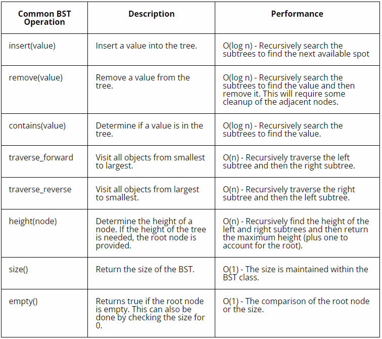

# Tree

A tree is a data structure that consists of nodes connected by pointers. It is a widely used data structure that resembles a tree in nature, with a single node known as the root and other nodes branching out from it.

## EXAMPLE OF TREE

Here is an example of binary tree, it is a tree that links to no more than two other nodes.


Node: Each element in the tree is called a node. Nodes can have zero or more child nodes.

Root: The topmost node of the tree, which does not have any parent nodes.

Parent and Child: A node that is connected to another node directly below it is considered the parent, while the connected node is its child.

Leaf: Nodes that do not have any child nodes are referred to as leaf nodes or terminal nodes.

Subtree: A subtree is a portion of the tree that consists of a node and all its descendants.

Here is an example of binary search tree:


When searching for a specific value in a binary search tree, comparisons are made at each node to determine whether to continue searching in the left or right subtree. By following the ordering property, the search operation can be performed by traversing only a fraction of the tree, resulting in a time complexity of O(log n) on average for search operations.

Using the tree above, we can determine where to put additional items. We always start at the root node and compare the new value with it. We keep comparing until we have found an empty place for the new node. For example, to insert the value 20, do the following:

Start at the root node 15 and compare with the new value 20

Since 20 is greater than 15, goto the right and visit node 24

Since 20 is less than 24, goto the left and see there is no additional node

Insert 20 in the empty spot to the left of 24.


## TREE IN PYTHON

The code below allows you to insert a new node with the given data into the BST.

```python
def insert(self, data):
	"""
	Insert 'data' into the BST.  If the BST
	is empty, then set the root equal to the new 
	node.  Otherwise, use _insert to recursively
	find the location to insert.
	"""
	if self.root is None:
		self.root = BST.Node(data)
	else:
		self._insert(data, self.root)  # Start at the root

def _insert(self, data, node):
	"""
	This function will look for a place to insert a node
	with 'data' inside of it.  The current subtree is
	represented by 'node'.  This function is intended to be
	called the first time by the insert function.
	"""
	if data < node.data:
		# The data belongs on the left side.
		if node.left is None:
			# We found an empty spot
			node.left = BST.Node(data)
		else:
			# Need to keep looking.  Call _insert
			# recursively on the left subtree.
			self._insert(data, node.left)
	elif data >= node.data:
		# The data belongs on the right side.
		if node.right is None:
			# We found an empty spot
			node.right = BST.Node(data)
		else:
			# Need to keep looking.  Call _insert
			# recursively on the right subtree.
			self._insert(data, node.right)

```

This code implements the standard logic for inserting a node into a binary search tree based on the comparison of data values. It ensures that the BST maintains the ordering property, where all values in the left subtree are less than the current node, and all values in the right subtree are greater than or equal to the current node.

Here is another example of using tree in python, the code below allows you to perform a in-order traversal of the BST and return a generator object that can be used in a loop to iterate over the values in the BST.

```python
def __iter__(self):
	"""
    Perform a forward traversal (in order traversal) starting from 
    the root of the BST.  This is called a generator function.
    This function is called when a loop	is performed:

	for value in my_bst:
		print(value)

	"""
	yield from self._traverse_forward(self.root)  # Start at the root

def _traverse_forward(self, node):
	"""
	Does a forward traversal (in-order traversal) through the 
	BST.  If the node that we are given (which is the current
	subtree) exists, then we will keep traversing on the left
	side (thus getting the smaller numbers first), then we will 
	provide the data in the current node, and finally we will 
	traverse on the right side (thus getting the larger numbers last).

	The use of the 'yield' will allow this function to support loops
	like:

	for value in my_bst:
		print(value)

    The keyword 'yield' will return the value for the 'for' loop to
    use.  When the 'for' loop wants to get the next value, the code in
    this function will start back up where the last 'yield' returned a 
    value.  The keyword 'yield from' is used when our generator function
    needs to call another function for which a `yield` will be called.  
    In other words, the `yield` is delegated by the generator function
    to another function.

	This function is intended to be called the first time by 
	the __iter__ function.
	"""
	if node is not None:
		yield from self._traverse_forward(node.left)
		yield node.data
		yield from self._traverse_forward(node.right)

```
This method provides a convenient way to access and process the values stored in the BST in a sorted order.You can use this code as part of a larger binary search tree implementation to enable iteration and traversal functionality.

## Big O Notation

The table below shows the common functions in a BST.




## Example Code: Searching Books

In this scenario, you are managing an online store that sells books. You have a large inventory of books, and you want to efficiently organize and search for books.

You can use a BST to accomplish this efficiently. Here's a simple code example:

```python
class BookNode:
    def __init__(self, isbn, title):
        self.isbn = isbn
        self.title = title
        self.left = None
        self.right = None

class BookInventory:
    def __init__(self):
        self.root = None

    def insert(self, isbn, title):
        """
        Insert a new book with the given ISBN and title into the BST.
        """
        if self.root is None:
            self.root = BookNode(isbn, title)
        else:
            self._insert(isbn, title, self.root)

    def _insert(self, isbn, title, node):
        """
	Insert a new book in the BST.
        """
        if isbn < node.isbn:
            if node.left is None:
                node.left = BookNode(isbn, title)
            else:
                self._insert(isbn, title, node.left)
        elif isbn > node.isbn:
            if node.right is None:
                node.right = BookNode(isbn, title)
            else:
                self._insert(isbn, title, node.right)

    def search(self, isbn):
        """
        Search for a book with the given ISBN in the BST.
        Returns the book's title if found, or None if not found.
        """
        return self._search(isbn, self.root)

    def _search(self, isbn, node):
        """
        Helper function to recursively search for a book with
        the given ISBN in the BST.
        """
        if node is None or node.isbn == isbn:
            return node.title
        if isbn < node.isbn:
            return self._search(isbn, node.left)
        else:
            return self._search(isbn, node.right)


```
In this example, we have a BookNode class that represents a node in the binary search tree. Each node has an ISBN and a title associated with it, as well as left and right child pointers.

The BookInventory class manages the book inventory using a binary search tree. It has methods like insert to insert a new book, _insert as a helper function for insertion, search to search for a book by its ISBN, and _search as a helper function for searching.

You can create an instance of the BookInventory class and use it to manage your book inventory. The insert method allows you to add books to the inventory, and the search method enables you to search for books by their ISBN.

This code provides a basic framework for managing books in a binary search tree based on their ISBN values.

## Problem to Solve : Merging Email Lists

Write a program to build a directory of employees for a company. Each employee has a unique employee ID and a corresponding name. You want to efficiently store and search for employee information based on their ID.


You can check your code with the solution here: [Solution](bst.py)


[Back to Welcome Page](0-Welcome.md)


